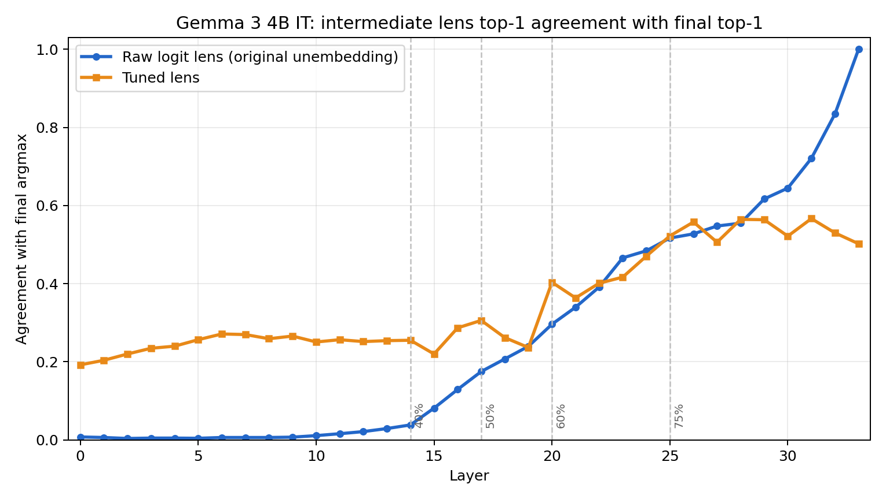

# Commitment-Driven Per-Token Mixed-Precision Inference

For greedy decoding, an LLM only needs the argmax of the final-layer logits; for sampling, the full distribution shape matters but the answer is often locked in well before the last layer. We will exploit this asymmetry by routing each token through one of two cheaper pathways instead of the full high-precision stack, decided on the fly from a mid-layer probe.

## Current Model Target

We are targeting **Gemma 3 4B IT** for the first prototype. This is large enough that late-layer weight movement can matter for wall-clock time, but small enough to keep engineering/debugging manageable.

## Determinator Starting Point

The determinator should start with the **raw logit lens** as the default signal:

1. Run the model to a probe layer.
2. Apply the model's own final norm / unembedding path to the intermediate residual state.
3. Fire only when the intermediate top-1 is high-confidence under deterministic rules such as top-1/top-2 logit gap, entropy, or margin threshold.

The tuned lens is included as an optional ablation for earlier probe layers. For Gemma 3 4B IT, the tuned lens helps in early/mid layers, but the raw logit lens catches up and is better in the late layers where the router is likely to operate.

Useful layer choices:

| Probe layer | Approx. depth | Raw top-1 agreement | Tuned top-1 agreement | Suggested role |
| ---: | ---: | ---: | ---: | --- |
| 20 | 60% | 0.296 | 0.403 | tuned-lens ablation |
| 25 | 75% | 0.517 | 0.522 | main mid/late probe candidate |
| 26 | 76% | 0.527 | 0.558 | main mid/late probe candidate |
| 29 | 85% | 0.617 | 0.564 | raw-lens late probe |
| 31 | 91% | 0.721 | 0.566 | raw-lens late probe |
| 32 | 94% | 0.835 | 0.530 | raw-lens late probe |

The practical recommendation is:

- **MVP:** raw logit lens at layers 25-29.
- **Ablation:** tuned lens at layers 20, 25, and 26.
- **Do not rely on tuned-lens KL for Gemma** until recalibrated; the prior validation showed weaker Gemma tuned-lens behavior than other model families.

## Included Artifacts

This repository includes the small artifacts needed to start the determinator work without pulling the full research workspace.

```text
artifacts/
  lenses/gemma3_4b_it/
    metadata/
      checkpoint.json
      training_summary.json
    probes/
      probe_layer_20.pt
      probe_layer_25.pt
      probe_layer_26.pt
  plots/gemma3_4b_it/
    gemma3_4b_it_raw_vs_tuned_top1_agreement.{png,pdf,csv}
  SHA256SUMS.txt
```

The plot below compares raw logit-lens and tuned-lens agreement with the final-layer argmax.



## Artifact Provenance

The tuned-lens probes were trained for 250 steps and pulled from:

```text
gs://pt-vs-it-results/tuned_lens_probes_v3/gemma3_4b/it/
```

Only layers 20, 25, and 26 are committed here because they are the relevant runtime-ablation layers and each probe is about 25 MiB. The full 34-layer tuned-lens set remains in GCS.

Verify committed artifacts with:

```bash
shasum -a 256 -c artifacts/SHA256SUMS.txt
```

## Next Engineering Tasks

1. Implement `determinator.score(hidden_state) -> confidence`.
2. Compare raw-lens thresholds against tuned-lens thresholds on held-out generation traces.
3. Plot coverage versus argmax-preservation rate.
4. Integrate the selected threshold into the two-path mixed-precision inference runner.
